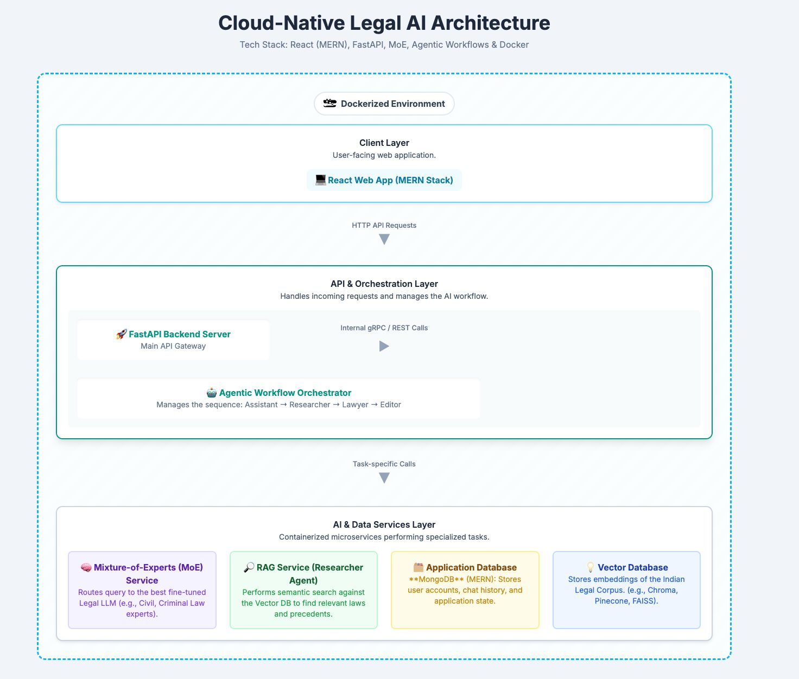
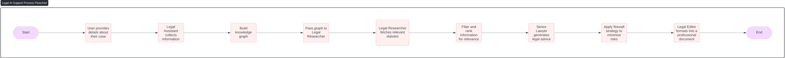

# ChatLaw-India 🇮🇳
<!-- ALL-CONTRIBUTORS-BADGE:START - Do not remove or modify this section -->
[](#contributors-)
<!-- ALL-CONTRIBUTORS-BADGE:END -->

A localized adaptation of [ChatLaw](https://github.com/PKU-YuanGroup/ChatLaw) for the Indian legal system.  
This project aims to develop a legal large language model (LLM) fine-tuned on Indian laws, statutes, and case data to provide accurate legal responses specific to the Indian legal context.

---

## 📌 Overview

This project is inspired by the [ChatLaw](https://github.com/PKU-YuanGroup/ChatLaw) model developed for Chinese legal systems. We adapt the methodology, training pipeline, and data structuring to the domain of **Indian laws** including:

- Indian Penal Code (IPC)
- Civil laws
- Case law judgments
- Constitution of India
- Legal proceedings in multiple jurisdictions

### Justifiaction of MultiAgent Architecture
The use of a multi-agent architecture in the ChatLaw model is crucial for delivering accurate and reliable legal services, 
particularly in addressing the persistent challenge of hallucinations often found in large language models. By dividing the 
consultation process into specialized roles—Legal Assistant, Legal Researcher, Senior Lawyer, and Legal Editor—the system ensures 
that each stage of legal reasoning is handled with domain-specific focus and verification.
    This modular design allows the Legal Researcher to actively retrieve and verify the latest legal statutes and precedents from 
trusted external sources, countering the risk of outdated or fabricated content generated by the base model. The Legal Assistant 
builds a structured knowledge graph to clarify and disambiguate user input, reducing the ambiguity that often leads to hallucinated 
responses. Meanwhile, the Senior Lawyer provides advisory content within a “firewall” framework that filters out speculative or 
unsupported statements. Finally, the Legal Editor ensures that only factually grounded and well-cited information makes it into the 
final output. Together, this collaborative architecture acts as a layered defense system, rigorously validating inputs and outputs 
to minimize factual errors and reinforce the model’s credibility and safety in high-stakes legal contexts.

---
## Architecture Diagram


---
## Workflow of the agents


---
## 🚀 Features

- Fine-tuned legal language model on Indian datasets
- Multilingual support (English, Hindi legal documents planned)
- Question-answering system tailored for Indian laws
- Open-source and reproducible training pipeline

---
## 🎯 Intended Users

### Primary Users
- **Legal Professionals** – Case analysis, drafting, and legal research.
- **Law Students** – Exam preparation, mock trials, and interactive learning.
- **Legal Researchers** – NLP benchmarking and legal dataset experimentation.
- **Legal Tech Developers** – Building AI chatbots and legal automation tools.
- **Public Legal Services** – Providing citizen-facing Q&A for Indian law.

### Secondary Users
- **Policy Makers** – Exploring AI adoption in the Indian judicial system.
- **AI/ML Researchers** – Studying multi-agent interactions and Ministry of Education (MoE) compliance in legal AI.
- **Corporate Legal Teams** – Running internal legal queries and compliance checks efficiently.
---

## 🛠️ Installation

Clone this repository:

```bash
git clone https://github.com/kmitofficial/JusticeBot-G458-PS25
cd JusticeBot-G458-PS25
```
---
## Team Members
- [M Adesh](https://github.com/adesh2756)
- [D Divyansh](https://github.com/Divyansh1586)
- [D V Shashank Shourie](https://github.com/Shashank-Shourie)
- [Nidhi D](https://github.com/nidhidev20)
- [C Naren](https://github.com/NarenCK11)
## Contributors ✨
<!-- Contributors will be automatically be updated when a commit is made -->
Thanks goes to these wonderful people ([emoji key](https://allcontributors.org/docs/en/emoji-key)):

<!-- ALL-CONTRIBUTORS-LIST:START - Do not remove or modify this section -->
<!-- prettier-ignore-start -->
<!-- markdownlint-disable -->
<!-- markdownlint-restore -->
<!-- prettier-ignore-end -->
<!-- ALL-CONTRIBUTORS-LIST:END -->

This project follows the [all-contributors](https://github.com/all-contributors/all-contributors) specification. Contributions of any kind welcome!